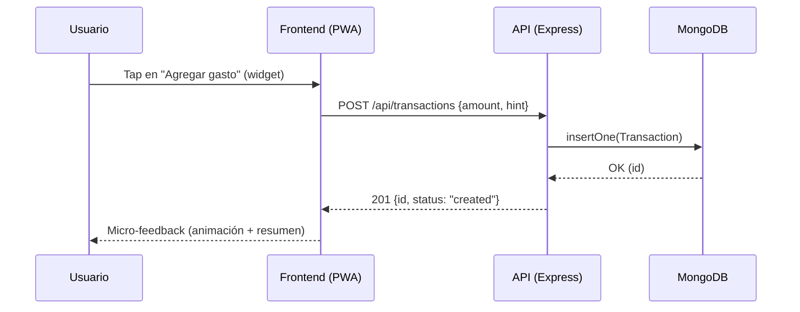

# Proyecto Integrador — FinanzApp (Documento de Diseño API)

## 1) Presentación
FinanzApp es una API para una app de finanzas personales enfocada en registro **rápido** y **manual** de movimientos, con objetivos de simplicidad, privacidad y educación financiera.

## 2) Diagrama Entidad-Relación (ER)
```mermaid
erDiagram
  User ||--o{ Category : "own"
  User ||--o{ Transaction : "has"
  User ||--o{ Budget : "sets"
  User ||--o{ Goal : "sets"
  Category ||--o{ Transaction : "classifies"

  User {
    string id
    string email
    string passwordHash
    string locale
    boolean twoFAEnabled
    datetime createdAt
    datetime updatedAt
  }

  Category {
    string id
    string userId
    string name
    enum type  // expense|income
    string icon
    string color
    datetime createdAt
    datetime updatedAt
  }

  Transaction {
    string id
    string userId
    enum kind // income|expense|transfer
    number amount
    date date
    string note
    string categoryId
    string fromAccount
    string toAccount
    string[] attachments
    datetime createdAt
    datetime updatedAt
  }

  Budget {
    string id
    string userId
    string month // YYYY-MM
    string categoryId
    number limit
    datetime createdAt
    datetime updatedAt
  }

  Goal {
    string id
    string userId
    string title
    number targetAmount
    date targetDate
    number savedAmount
    datetime createdAt
    datetime updatedAt
  }
```

## 3) Diagrama de Secuencia — Flujo principal: "Registrar gasto rápido"


## 4) Notas de implementación
- MVC modular por dominio: rutas/controladores/modelos independientes.
- Autenticación: pendiente de JWT (esqueleto de middleware incluido).
- Swagger: disponible en `/docs`, permite ejecutar endpoints dummy.
- Variables de entorno: `.env` (ejemplo provisto).

## 5) Próximos pasos
- Implementar lógica real en controladores.
- Añadir validaciones (Zod/celebrate) y DTOs.
- Integrar pruebas (Vitest/Jest) y CI.
- Añadir rate limits por ruta sensible.
```)
